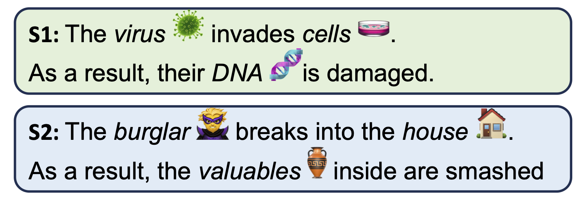

# StoryAnalogy: Deriving Story-level Analogies from Large Language Models to Unlock Analogical Understanding.

This is the official repo for the paper **StoryAnalogy: Deriving Story-level Analogies from Large Language Models to Unlock Analogical Understanding** [[Arxiv]](https://arxiv.org/abs/2310.12874) [[Poster]](raw/Poster%20-%20StoryAnalogy%20Deriving%20Story-level%20Analogies%20from%20Large%20Language%20Models%20to%20Unlock%20Analogical%20Understanding.pdf). 

<!-- In this work, we built a story level analogy dataset (**StoryAnalogy**), which could be accessed at `src/data`. -->

<div style="width:80%; text-align:center; float: center;">
    <figure >
        
        <figcaption>
            An example analogy between story S1 and S2.
            </figcaption>
    </figure>
</div>


## Reproduce the results

We are currently actively preparing the presentation materials and will update the code shortly.

TODO-list

- Reframe the dataset with huggingface datasets and present a dataset card.
- Organize & release code for the experiments.
- A quick-start demo. 

## Bugs or questions?

If you have any questions related to the code or the paper, please feel free to email us at `jchengaj@cse.ust.hk`.


## Citation

```bibtex
@article{jiayang2023storyanalogy,
  title={StoryAnalogy: Deriving Story-level Analogies from Large Language Models to Unlock Analogical Understanding},
  author={Jiayang, Cheng and Qiu, Lin and Chan, Tsz Ho and Fang, Tianqing and Wang, Weiqi and Chan, Chunkit and Ru, Dongyu and Guo, Qipeng and Zhang, Hongming and Song, Yangqiu and others},
  journal={arXiv preprint arXiv:2310.12874},
  year={2023}
}
```
